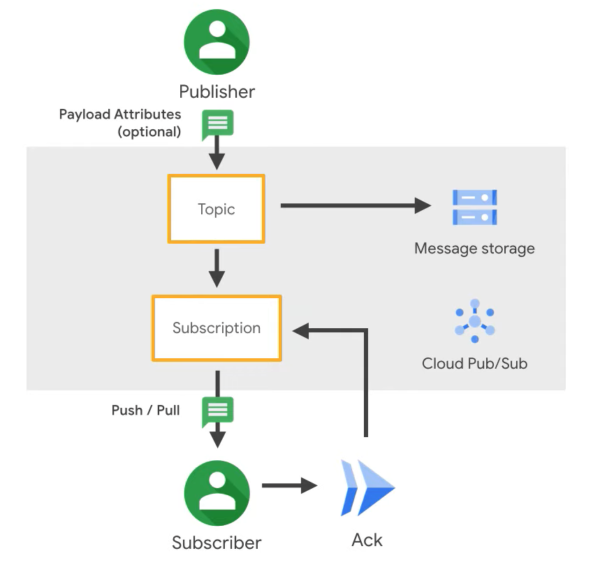

# Consuming GCP PubSub messages with Spring batch

---

## Jose Granados

### Software Developer Architect
<!-- .slide: style="text-align: left;"> -->
<i class="fab fa-twitter"></i><a href="https://twitter.com/ppgranados">  @ppgranados</a> 
<i class="fas fa-envelope"></i>  pp.granados@gmail.com 
<i class="fab fa-github"></i><a href="https://github.com/ppgranados">  github.com/ppgranados</a>

---

## Agenda
<!-- .slide: style="text-align: left;"> -->
- GPC Pub/Sub 
- Spring Batch 
- Use case 
- Demo 

---

# GPC Pub/Sub
<!-- .slide: style="text-align: left;"> -->
Cloud Pub/Sub is a fully managed real-time messaging service that allows you to send and receive messages between independent applications.

"Pub/Sub allows services to communicate asynchronously, with latencies on the order of 100 milliseconds" 

---

# GPC Pub/Sub
<!-- .slide: style="text-align: left;"> -->

---

## Spring Batch
<!-- .slide: style="text-align: left;"> -->
Framework to create batch processing applications, provides reusable functions that are essential in processing large volumes of records, including logging/tracing, transaction management, job processing statistics, job restart, skip, and resource management.

Batch processing is used to process billions of transactions every day for enterprises.

Features:
- Transaction management
- Chunk based processing
- Declarative I/O
- Start/Stop/Restart
- Retry/Skip
- Web based administration interface

---

## Spring Batch key concepts
<!-- .slide: style="text-align: left;"> -->

- Jobs
- Steps
- Readers
- Writers
- Listeners

---

## Spring Batch key concepts
<!-- .slide: style="text-align: left;"> -->

---

## Namespaces
<!-- .slide: style="text-align: left;"> -->
Control what a container can see 
 
Used to control:- 
- Hostname within the container
- Processes that the container can see
- Mapping users in the container to users on the host

---

## File system
<!-- .slide: style="text-align: left;"> -->
- Containers cannot see the entire host's filesystem 
- They can only see a subset of that filesystem 
- The container root directory is changed

---

## Default networks
<!-- .slide: style="text-align: left;"> -->

- bridge 
- host 
- none 

---

## Bridge network
<!-- .slide: style="text-align: left;"> -->
- Default network 
- Represents _docker0_ network 
- Containers communicate by IP address 
- Supports port mapping

---

## User defined networks
<!-- .slide: style="text-align: left;"> -->
- Docker provide multiple drivers 
- DNS resolution of container names to IP addresses 
- Can be connected to more than one network 
- Connect/disconnect from networks without restarting 

---

## Options for persisting data
<!-- .slide: style="text-align: left;"> -->
- Bind mounts 
- Data volume containers 
- Named volumes

---

## Building your own image
<!-- .slide: style="text-align: left;"> -->
- Custom images built from a file 
- Known as a dockerfile 
- Customise the image to grant permissions 
- Add databases to SQL Server 

---

## Dockerfile

<pre><code data-line-numbers="1|3|5-8|10|12|14">FROM mcr.microsoft.com/mssql/server:2019-CU5-ubuntu-18.04

USER root

RUN mkdir /var/opt/sqlserver
RUN mkdir /var/opt/sqlserver/sqldata
RUN mkdir /var/opt/sqlserver/sqllog
RUN mkdir /var/opt/sqlserver/sqlbackups

RUN chown -R mssql /var/opt/sqlserver

USER mssql

CMD /opt/mssql/bin/sqlservr
</pre></code>

---

## Docker container run

<pre><code data-line-numbers="1|2|3-8|9|10-13|14|15">docker run -d
--publish 15789:1433
--env SA_PASSWORD=Testing1122
--env ACCEPT_EULA=Y
--env MSSQL_AGENT_ENABLED=True
--env MSSQL_DATA_DIR=/var/opt/sqlserver/sqldata
--env MSSQL_LOG_DIR=/var/opt/sqlserver/sqllog
--env MSSQL_BACKUP_DIR=/var/opt/sqlserver/sqlbackups
--network sqlserver
--volume sqlsystem:/var/opt/mssql
--volume sqldata:/var/opt/sqlserver/sqldata
--volume sqllog:/var/opt/sqlserver/sqllog
--volume sqlbackup:/var/opt/sqlserver/sqlbackups
--name sqlcontainer1
mcr.microsoft.com/mssql/server:2019-CU5-ubuntu-18.04
</pre></code>

---

## What is Compose?
<!-- .slide: style="text-align: left;"> -->
"Compose is a tool for defining and running multi-container Docker applications.
With Compose, you use a YAML file to configure your application`s services.
Then, with a single command, you create and start all the services from your configuration." 
<a href="https://docs.docker.com/compose/">docs.docker.com/compose</a>

---

## Resources
<!-- .slide: style="text-align: left;"> -->

<a href="https://github.com/dbafromthecold/DockerDeepDive">https://github.com/dbafromthecold/DockerDeepDive</a> 
<a href="http://tinyurl.com/y3x29t3j/summary-of-my-container-series">http://tinyurl.com/y3x29t3j/summary-of-my-container-series</a> 
<a href="https://github.com/dbafromthecold/SqlServerAndContainersGuide">https://github.com/dbafromthecold/SqlServerAndContainersGuide</a>

